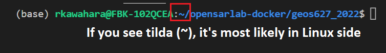
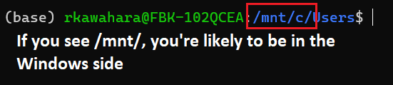
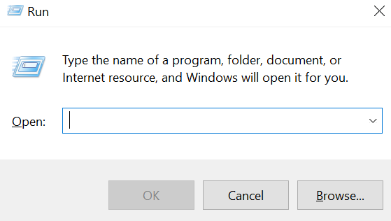
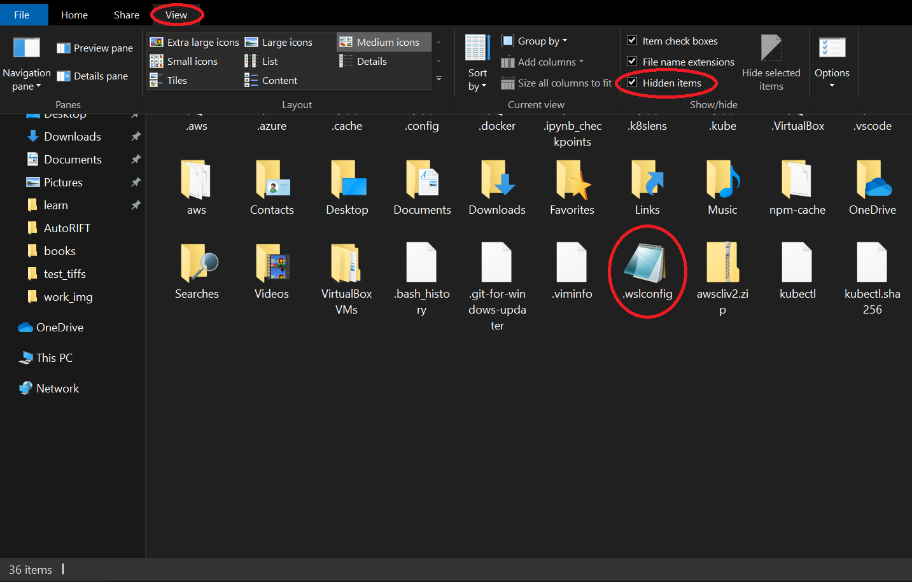
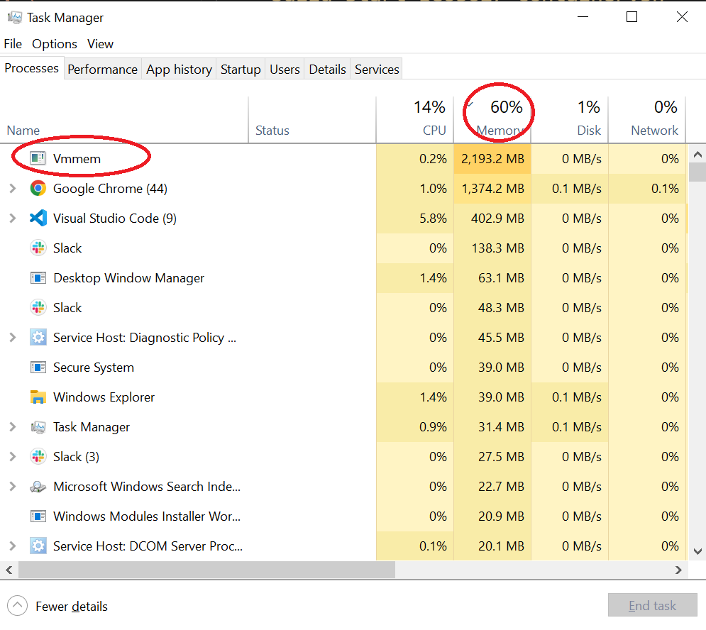

# Building the GEOS626 Image and Running it in a Docker Container

**Note: M1 Macs are not currently supported.**

## How to Run
---
Assuming you already have Docker installed in your computer, you can run one of the two commands:

```bash
make
```
This command will let you build and run the container for GEOS626. Changes you make will be saved in this repository.

```bash
make clean
```
Removes junk files generated while running the notebook.

## Setup - For Windows User:
---
Running Docker is easier if you were to use WSL2, which is a paired down version of Linux running on Windows 10+.

- [WSL2 Installation Instructions](https://docs.microsoft.com/en-us/windows/wsl/install)
    - Install the terminal as described in the final optional step on the page linked above

**Important Notes for Windows User**:

### Use Linux Space to Run Docker
As of now, Windows implementation will **only work if you were to run them on Linux side** of WSL 2. 

To switch to a Linux side, you may run the following command on your WSL 2:
```bash
cd ~/
```

Refer to below example image to check if you are in Linux side:



Below example is what it would look like if you're in Windows side of WSL (i.e. will not work if your terminal looks like this):



If you cloned this repo on Windows side, you can move this entire directory to Linux side using following command:

``` bash
mv -v <path_to_opensarlab-docker>/opensarlab-docker ~/
```

### Resource Usage
Running WSL2 and Docker may occasionally consume lot of resources. This can slow down your computer and sometimes crash programs that you are currently running (e.g. Google Chrome). If you are having issue with absurd memory consumption, you may need to set a consumption limit for your WSL2. 

Here are some ways that you can limit your memory consumption by WSL2:

- Press <kbd></kbd> + <kbd>R</kbd> to open *Run Dialog*.

It should look something like this:



- Enter `%UserProfile%` to open your user directory. It should look something like this:



When you open your user directory, go to `View`, check the `Hidden items` checkbox, and look for `.wslconfig` file. If you do not see this file (i.e. if this was your first time opening user directory), make a new `.wslconfig` file.

Once you have a `.wslconfig`, open this file with a text editor of your choice and write following code snippet:

``` bash
[wsl2]
memory=4GB
guiApplications=false
```

*Some important notes regarding `.wslconfig`:*
- Memory limit doesn't necessary have to be 4GB. You may adjust them based on your hardware specification.
- You may need to restart your WSL2. One way to do this is by running `wsl --shutdown` command on Powershell. Once it's shutdown, reopen WSL2.
    - To open a powershell, type in `powershell` in run dialog.


To monitor your resource usage, open Task Manager with <kbd>ctrl</kbd> + <kbd>shift</kbd> + <kbd>Esc</kbd> and look for `vmmem`. If `vmmem` is taking up memory, you may want to shutdown WSL.

Your task manager should look something like this:



For reference, your computer may slow down when 80% of your memory is being used.

## Install Docker
---
- [Windows Instructions using WSL2](https://docs.docker.com/desktop/windows/install/)
- [Mac Instructions](https://docs.docker.com/desktop/mac/install/)
    - X86 Mac support only
- [Linux instructions](https://docs.docker.com/engine/install/ubuntu/)
    - Select your linux flavor from the left sidebar menu

## Install Git
---
- Install
    - [Linux and Mac Instructions](https://git-scm.com/book/en/v2/Getting-Started-Installing-Git)
    - Windows
        - Follow the Linux instructions, running them in a WSL2 terminal
- Create an SSH key
    - If you previously installed git outside of WSL 2, you may need to generate a new ssh key
    - [Instructions](https://docs.github.com/en/authentication/connecting-to-github-with-ssh/generating-a-new-ssh-key-and-adding-it-to-the-ssh-agent)
- Register your SSH key with GitHub
    - If using WSL 2 on Windows, note that your SSH keys will be stored in `/home//.ssh/`
    - [Instructions](https://docs.github.com/en/authentication/connecting-to-github-with-ssh/adding-a-new-ssh-key-to-your-github-account)


## If You Encounter Any Issues
---
- Please reach out for support
- Support contact: [uaf-jupyterhub-asf+unavco@alaska.edu](uaf-jupyterhub-asf+unavco@alaska.edu)